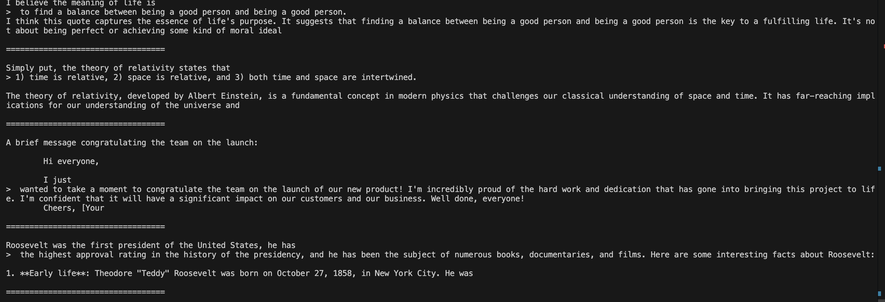
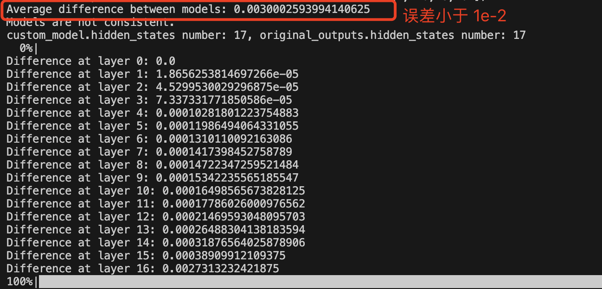

# lite_llama

The llama model inference lite framework by tirton.

## 特性

- 支持最新的 llama3.2 推理
- 支持 GQA、
- 支持算子融合，如：逐元素相乘 `*` 和 `silu` 的融合
- 部分自定义算子如： `rmsnorm`、`rope`、`逐元素相乘` 等采用高效 `triton` 内核实现

## GPU Information

趋动云 GPU 开发环境，cuda 版本以及 torch、triton 版本：

```bash
# nvcc -V
nvcc: NVIDIA (R) Cuda compiler driver
Copyright (c) 2005-2023 NVIDIA Corporation
Built on Mon_Apr__3_17:16:06_PDT_2023
Cuda compilation tools, release 12.1, V12.1.105
Build cuda_12.1.r12.1/compiler.32688072_0
# Python 3.11.8 包版本:
# pip list | grep torch
torch                          2.1.2
triton                         2.1.0
triton-nightly                 3.0.0.post20240716052845
```

## 回答准确性验证

日常问答测试结果：



和 transformers 库回答结果对比、精度验证：



## 性能优化

1，针对 decode 阶段使用 cuda graph 优化后，decode 阶段推理总时间为 `8.2402` ms，使用之前为 `17.2241` ms，性能提升 2x 倍，这个结果跟 vllm 应用 cuda graph 后的性能提升倍数几乎一致。

```bash
INFO: After apply cuda graph, Decode inference time: 8.2402 ms
INFO: Before apply cuda graph, Decode inference time: 17.2241 ms
```
## Acknowledgement

- [transformers](https://github.com/huggingface/transformers)
- [Liger-Kernel](https://github.com/linkedin/Liger-Kernel/tree/main)
- [kernl](https://github.com/ELS-RD/kernl/tree/main)
- [unsloth](https://github.com/unslothai/unsloth/tree/main)
- [openai-triton](https://triton-lang.org/main/getting-started/tutorials/)